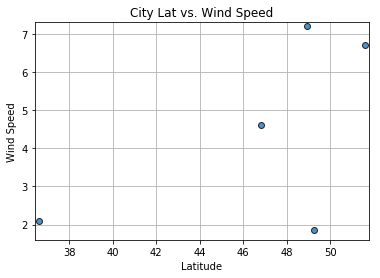

```python
# see UTAUS201801DATA2-Class-Repository-DATA/Lessons/06-Python-APIs/3/Activities/07-Stu_BankDeserts/Solved/Banking_Deserts_Solved.ipynb
# Dependencies
import csv
import matplotlib.pyplot as plt
import openweathermapy as ow
import pandas as pd
```


```python
# Create a settings object with your API key and preferred units
api_key = "694c973930a2847b56d79fbdfe256527"
settings = {"units": "metric", "appid": api_key}
```


```python
csv = ("../HW 6/worldcities.csv")
data = pd.read_csv(csv)

data.head()
```


<div>
<style>
    .dataframe thead tr:only-child th {
        text-align: right;
    }

    .dataframe thead th {
        text-align: left;
    }

    .dataframe tbody tr th {
        vertical-align: top;
    }
</style>
<table border="1" class="dataframe">
  <thead>
    <tr style="text-align: right;">
      <th></th>
      <th>Country</th>
      <th>City</th>
      <th>Latitude</th>
      <th>Longitude</th>
    </tr>
  </thead>
  <tbody>
    <tr>
      <th>0</th>
      <td>ad</td>
      <td>andorra la vella</td>
      <td>42.500000</td>
      <td>1.516667</td>
    </tr>
    <tr>
      <th>1</th>
      <td>ad</td>
      <td>canillo</td>
      <td>42.566667</td>
      <td>1.600000</td>
    </tr>
    <tr>
      <th>2</th>
      <td>ad</td>
      <td>encamp</td>
      <td>42.533333</td>
      <td>1.583333</td>
    </tr>
    <tr>
      <th>3</th>
      <td>ad</td>
      <td>la massana</td>
      <td>42.550000</td>
      <td>1.516667</td>
    </tr>
    <tr>
      <th>4</th>
      <td>ad</td>
      <td>les escaldes</td>
      <td>42.500000</td>
      <td>1.533333</td>
    </tr>
  </tbody>
</table>
</div>


```python
#Randomly select 500 cities, this code works, but fails and receives HTTP error 404 when sample
#larger than 5
selected_cities = data.sample(n=5)

selected_cities
```


<div>
<style>
    .dataframe thead tr:only-child th {
        text-align: right;
    }

    .dataframe thead th {
        text-align: left;
    }

    .dataframe tbody tr th {
        vertical-align: top;
    }
</style>
<table border="1" class="dataframe">
  <thead>
    <tr style="text-align: right;">
      <th></th>
      <th>Country</th>
      <th>City</th>
      <th>Latitude</th>
      <th>Longitude</th>
    </tr>
  </thead>
  <tbody>
    <tr>
      <th>9777</th>
      <td>de</td>
      <td>voerde</td>
      <td>51.600000</td>
      <td>6.683333</td>
    </tr>
    <tr>
      <th>34151</th>
      <td>ro</td>
      <td>sant</td>
      <td>47.450000</td>
      <td>24.900000</td>
    </tr>
    <tr>
      <th>42460</th>
      <td>us</td>
      <td>pacific grove</td>
      <td>36.617778</td>
      <td>-121.915556</td>
    </tr>
    <tr>
      <th>34786</th>
      <td>ro</td>
      <td>zanesti</td>
      <td>46.816667</td>
      <td>26.550000</td>
    </tr>
    <tr>
      <th>1743</th>
      <td>be</td>
      <td>saint-leger</td>
      <td>49.616667</td>
      <td>5.650000</td>
    </tr>
  </tbody>
</table>
</div>


```python
city = selected_cities["City"]
city.head()
```


    9777            voerde
    34151             sant
    42460    pacific grove
    34786          zanesti
    1743       saint-leger
    Name: City, dtype: object


```python
weather_data = [ow.get_current(city, **settings) for city in city]
weather_data
```


    [{'base': 'stations',
      'clouds': {'all': 0},
      'cod': 200,
      'coord': {'lat': 51.6, 'lon': 6.68},
      'dt': 1519876500,
      'id': 2817065,
      'main': {'humidity': 52,
       'pressure': 1012,
       'temp': -7.52,
       'temp_max': -7,
       'temp_min': -9},
      'name': 'Voerde',
      'sys': {'country': 'DE',
       'id': 4886,
       'message': 0.0052,
       'sunrise': 1519885108,
       'sunset': 1519924414,
       'type': 1},
      'visibility': 10000,
      'weather': [{'description': 'clear sky',
        'icon': '01n',
        'id': 800,
        'main': 'Clear'}],
      'wind': {'deg': 80, 'speed': 6.7}},
     {'base': 'stations',
      'clouds': {'all': 8},
      'cod': 200,
      'coord': {'lat': 49.25, 'lon': 105.38},
      'dt': 1519878468,
      'id': 2029840,
      'main': {'grnd_level': 912.72,
       'humidity': 54,
       'pressure': 912.72,
       'sea_level': 1020.93,
       'temp': -9.47,
       'temp_max': -9.47,
       'temp_min': -9.47},
      'name': 'Sant',
      'sys': {'country': 'MN',
       'message': 0.004,
       'sunrise': 1519861284,
       'sunset': 1519900864},
      'weather': [{'description': 'clear sky',
        'icon': '02d',
        'id': 800,
        'main': 'Clear'}],
      'wind': {'deg': 187.501, 'speed': 1.86}},
     {'base': 'stations',
      'clouds': {'all': 75},
      'cod': 200,
      'coord': {'lat': 36.62, 'lon': -121.92},
      'dt': 1519876500,
      'id': 5380437,
      'main': {'humidity': 76,
       'pressure': 1021,
       'temp': 10.49,
       'temp_max': 11,
       'temp_min': 10},
      'name': 'Pacific Grove',
      'sys': {'country': 'US',
       'id': 431,
       'message': 0.0074,
       'sunrise': 1519915071,
       'sunset': 1519956149,
       'type': 1},
      'visibility': 16093,
      'weather': [{'description': 'broken clouds',
        'icon': '04n',
        'id': 803,
        'main': 'Clouds'}],
      'wind': {'speed': 2.1}},
     {'base': 'stations',
      'clouds': {'all': 0},
      'cod': 200,
      'coord': {'lat': 46.82, 'lon': 26.55},
      'dt': 1519876800,
      'id': 662315,
      'main': {'humidity': 71,
       'pressure': 1020,
       'temp': -14,
       'temp_max': -14,
       'temp_min': -14},
      'name': 'Zanesti',
      'sys': {'country': 'RO',
       'id': 5984,
       'message': 0.0047,
       'sunrise': 1519880018,
       'sunset': 1519919961,
       'type': 1},
      'visibility': 10000,
      'weather': [{'description': 'clear sky',
        'icon': '01n',
        'id': 800,
        'main': 'Clear'}],
      'wind': {'deg': 310, 'speed': 4.6}},
     {'base': 'stations',
      'clouds': {'all': 90},
      'cod': 200,
      'coord': {'lat': 48.93, 'lon': -0.86},
      'dt': 1519876800,
      'id': 2967970,
      'main': {'humidity': 79,
       'pressure': 997,
       'temp': -4,
       'temp_max': -4,
       'temp_min': -4},
      'name': 'Saint-Leger',
      'sys': {'country': 'FR',
       'id': 5635,
       'message': 0.0045,
       'sunrise': 1519886725,
       'sunset': 1519926412,
       'type': 1},
      'visibility': 8000,
      'weather': [{'description': 'light snow',
        'icon': '13n',
        'id': 600,
        'main': 'Snow'}],
      'wind': {'deg': 80, 'speed': 7.2}}]


```python

summary = ["name","clouds.all","sys.country","dt","main.humidity","coord.lat", "coord.lon","main.temp_max","wind.speed"]
summary
```


    ['name',
     'clouds.all',
     'sys.country',
     'dt',
     'main.humidity',
     'coord.lat',
     'coord.lon',
     'main.temp_max',
     'wind.speed']


```python
data = [response(*summary) for response in weather_data]
data
```


    [('Voerde', 0, 'DE', 1519876500, 52, 51.6, 6.68, -7, 6.7),
     ('Sant', 8, 'MN', 1519878468, 54, 49.25, 105.38, -9.47, 1.86),
     ('Pacific Grove', 75, 'US', 1519876500, 76, 36.62, -121.92, 11, 2.1),
     ('Zanesti', 0, 'RO', 1519876800, 71, 46.82, 26.55, -14, 4.6),
     ('Saint-Leger', 90, 'FR', 1519876800, 79, 48.93, -0.86, -4, 7.2)]


```python
column_names = ["City", " Cloudiness", "Country","Date", "Humidity", "Lat", "Lon", "Max Temp", "Wind Speed"]
weather_datadf = pd.DataFrame(data, index=city, columns=column_names)
```


```python
weather_datadf
```


<div>
<style>
    .dataframe thead tr:only-child th {
        text-align: right;
    }

    .dataframe thead th {
        text-align: left;
    }

    .dataframe tbody tr th {
        vertical-align: top;
    }
</style>
<table border="1" class="dataframe">
  <thead>
    <tr style="text-align: right;">
      <th></th>
      <th>City</th>
      <th>Cloudiness</th>
      <th>Country</th>
      <th>Date</th>
      <th>Humidity</th>
      <th>Lat</th>
      <th>Lon</th>
      <th>Max Temp</th>
      <th>Wind Speed</th>
    </tr>
    <tr>
      <th>City</th>
      <th></th>
      <th></th>
      <th></th>
      <th></th>
      <th></th>
      <th></th>
      <th></th>
      <th></th>
      <th></th>
    </tr>
  </thead>
  <tbody>
    <tr>
      <th>voerde</th>
      <td>Voerde</td>
      <td>0</td>
      <td>DE</td>
      <td>1519876500</td>
      <td>52</td>
      <td>51.60</td>
      <td>6.68</td>
      <td>-7.00</td>
      <td>6.70</td>
    </tr>
    <tr>
      <th>sant</th>
      <td>Sant</td>
      <td>8</td>
      <td>MN</td>
      <td>1519878468</td>
      <td>54</td>
      <td>49.25</td>
      <td>105.38</td>
      <td>-9.47</td>
      <td>1.86</td>
    </tr>
    <tr>
      <th>pacific grove</th>
      <td>Pacific Grove</td>
      <td>75</td>
      <td>US</td>
      <td>1519876500</td>
      <td>76</td>
      <td>36.62</td>
      <td>-121.92</td>
      <td>11.00</td>
      <td>2.10</td>
    </tr>
    <tr>
      <th>zanesti</th>
      <td>Zanesti</td>
      <td>0</td>
      <td>RO</td>
      <td>1519876800</td>
      <td>71</td>
      <td>46.82</td>
      <td>26.55</td>
      <td>-14.00</td>
      <td>4.60</td>
    </tr>
    <tr>
      <th>saint-leger</th>
      <td>Saint-Leger</td>
      <td>90</td>
      <td>FR</td>
      <td>1519876800</td>
      <td>79</td>
      <td>48.93</td>
      <td>-0.86</td>
      <td>-4.00</td>
      <td>7.20</td>
    </tr>
  </tbody>
</table>
</div>


```python
plt.scatter(weather_datadf["Lat"], 
            weather_datadf["Max Temp"],
            edgecolor="black", linewidths=1, marker="o", 
            alpha=0.8, label="Test Location")

# Incorporate the other graph properties
plt.title("City Lat vs. Max Temp")
plt.ylabel("Max Temp (C)")
plt.xlabel("Latitude")
plt.grid(True)
plt.xlim([36.40, 51.80])
plt.ylim([-20, 50])

# Save the figure
plt.savefig("City Lat vs Max Temp.png")

# Show plot
plt.show()
```


```python
plt.scatter(weather_datadf["Lat"], 
            weather_datadf["Humidity"],
            edgecolor="black", linewidths=1, marker="o", 
            alpha=0.8, label="Test Location")

# Incorporate the other graph properties
plt.title("City Lat vs. Humidity")
plt.ylabel("Humidity")
plt.xlabel("Latitude")
plt.grid(True)
plt.xlim([36.40, 51.80])
plt.ylim([50, 80])

# Save the figure
plt.savefig("City Lat vs Humidity.png")

# Show plot
plt.show()
```


```python
plt.scatter(weather_datadf["Lat"], 
            weather_datadf["Cloudiness"],
            edgecolor="black", linewidths=1, marker="o", 
            alpha=0.8, label="Test Location")

# Incorporate the other graph properties
plt.title("City Lat vs. Cloudiness")
plt.ylabel("Cloudiness")
plt.xlabel("Latitude")
plt.grid(True)
plt.xlim([36.40, 51.80])
plt.ylim([-1, 100])

# Save the figure
plt.savefig("City Lat vs Cloudiness.png")

# Show plot
plt.show()
```


    ---------------------------------------------------------------------------

    KeyError                                  Traceback (most recent call last)

    ~/anaconda3/lib/python3.6/site-packages/pandas/core/indexes/base.py in get_loc(self, key, method, tolerance)
       2441             try:
    -> 2442                 return self._engine.get_loc(key)
       2443             except KeyError:


    pandas/_libs/index.pyx in pandas._libs.index.IndexEngine.get_loc()


    pandas/_libs/index.pyx in pandas._libs.index.IndexEngine.get_loc()


    pandas/_libs/hashtable_class_helper.pxi in pandas._libs.hashtable.PyObjectHashTable.get_item()


    pandas/_libs/hashtable_class_helper.pxi in pandas._libs.hashtable.PyObjectHashTable.get_item()


    KeyError: 'Cloudiness'

    
    During handling of the above exception, another exception occurred:


    KeyError                                  Traceback (most recent call last)

    <ipython-input-71-eb0bb9168582> in <module>()
          1 plt.scatter(weather_datadf["Lat"], 
    ----> 2             weather_datadf["Cloudiness"],
          3             edgecolor="black", linewidths=1, marker="o",
          4             alpha=0.8, label="Test Location")
          5 


    ~/anaconda3/lib/python3.6/site-packages/pandas/core/frame.py in __getitem__(self, key)
       1962             return self._getitem_multilevel(key)
       1963         else:
    -> 1964             return self._getitem_column(key)
       1965 
       1966     def _getitem_column(self, key):


    ~/anaconda3/lib/python3.6/site-packages/pandas/core/frame.py in _getitem_column(self, key)
       1969         # get column
       1970         if self.columns.is_unique:
    -> 1971             return self._get_item_cache(key)
       1972 
       1973         # duplicate columns & possible reduce dimensionality


    ~/anaconda3/lib/python3.6/site-packages/pandas/core/generic.py in _get_item_cache(self, item)
       1643         res = cache.get(item)
       1644         if res is None:
    -> 1645             values = self._data.get(item)
       1646             res = self._box_item_values(item, values)
       1647             cache[item] = res


    ~/anaconda3/lib/python3.6/site-packages/pandas/core/internals.py in get(self, item, fastpath)
       3588 
       3589             if not isnull(item):
    -> 3590                 loc = self.items.get_loc(item)
       3591             else:
       3592                 indexer = np.arange(len(self.items))[isnull(self.items)]


    ~/anaconda3/lib/python3.6/site-packages/pandas/core/indexes/base.py in get_loc(self, key, method, tolerance)
       2442                 return self._engine.get_loc(key)
       2443             except KeyError:
    -> 2444                 return self._engine.get_loc(self._maybe_cast_indexer(key))
       2445 
       2446         indexer = self.get_indexer([key], method=method, tolerance=tolerance)


    pandas/_libs/index.pyx in pandas._libs.index.IndexEngine.get_loc()


    pandas/_libs/index.pyx in pandas._libs.index.IndexEngine.get_loc()


    pandas/_libs/hashtable_class_helper.pxi in pandas._libs.hashtable.PyObjectHashTable.get_item()


    pandas/_libs/hashtable_class_helper.pxi in pandas._libs.hashtable.PyObjectHashTable.get_item()


    KeyError: 'Cloudiness'


```python
plt.scatter(weather_datadf["Lat"], 
            weather_datadf["Wind Speed"],
            edgecolor="black", linewidths=1, marker="o", 
            alpha=0.8, label="Test Location")

# Incorporate the other graph properties
plt.title("City Lat vs. Wind Speed")
plt.ylabel("Wind Speed")
plt.xlabel("Latitude")
plt.grid(True)
plt.xlim([36.40, 51.80])
plt.ylim([1.6, 7.3])

# Save the figure
plt.savefig("City Lat vs Cloudiness.png")

# Show plot
plt.show()
```




